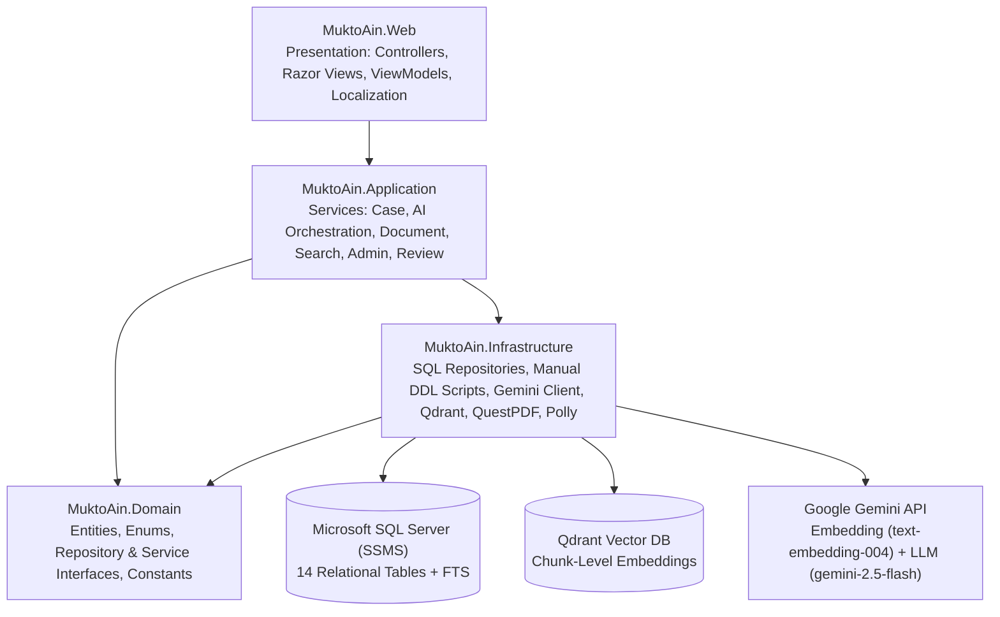

# MuktoAin — Architecture & Database Design

This document details the system design, 4-project clean architecture, complete 14-entity relational schema, and the RAG retrieval pipeline.

---

## 1. System Architecture Diagram

---

## 2. 14-Entity Data Model

Authoritative ERD structure matching `MuktoAin_ERD_v3.drawio`:

### 2.1 Identity & Access
1. **`USER`**
   - `UserId` (PK, INT IDENTITY)
   - `FullName` (NVARCHAR(150))
   - `Email` (NVARCHAR(256), UNIQUE)
   - `PhoneNumber` (NVARCHAR(20), NULLABLE)
   - `Role` (INT / Enum: 0=Citizen, 1=Lawyer, 2=Admin)
   - `AccountStatus` (INT / Enum: 0=Active, 1=Suspended)
   - `PreferredLanguage` (NVARCHAR(10), e.g., 'bn', 'en')
   - `CreatedByAdminId` (FK $\rightarrow$ `USER.UserId`, NULLABLE) — Enforces "admins can only be created by admins"
   - `CreatedAt` (DATETIME2)

2. **`LAWYER_PROFILE`** (Table-per-Type Specialization of `USER`)
   - `LawyerProfileId` (PK, INT IDENTITY)
   - `UserId` (FK $\rightarrow$ `USER.UserId`, UNIQUE) — 1-to-(0..1) relationship
   - `BarRegistrationNumber` (NVARCHAR(100), UNIQUE)
   - `VerificationStatus` (INT / Enum: 0=Pending, 1=Approved, 2=Rejected)
   - `VerifiedByAdminId` (FK $\rightarrow$ `USER.UserId`, NULLABLE) — Admin who audited the credentials
   - `Specialization` (NVARCHAR(200), NULLABLE)
   - `VerifiedAt` (DATETIME2, NULLABLE)
   *Note: Contains NO direct `CaseId` column.*

### 2.2 Case Intake & Categorization
3. **`CASE_CATEGORY`**
   - `CategoryId` (PK, INT IDENTITY)
   - `Name` (NVARCHAR(100))
   - `Description` (NVARCHAR(500))

4. **`DISTRICT`** (64 Bangladesh Administrative Districts)
   - `DistrictId` (PK, TINYINT)
   - `Name` (NVARCHAR(100), UNIQUE)

5. **`CASE`**
   - `CaseId` (PK, INT IDENTITY)
   - `UserId` (FK $\rightarrow$ `USER.UserId`, NULLABLE) — Supports guest submissions
   - `CategoryId` (FK $\rightarrow$ `CASE_CATEGORY.CategoryId`)
   - `DistrictId` (FK $\rightarrow$ `DISTRICT.DistrictId`) — Validates geographical context for police station/court jurisdiction
   - `Title` (NVARCHAR(250))
   - `Description` (NVARCHAR(MAX))
   - `Language` (NVARCHAR(10))
   - `Status` (INT / Enum: 0=Submitted, 1=UnderReview, 2=Finalized)
   - `IsAnonymous` (BIT) — Explicit flag
   - `CreatedAt` (DATETIME2)
   - `UpdatedAt` (DATETIME2)

### 2.3 Legal Knowledge Base (Statutory Corpus)
6. **`ACT`**
   - `ActId` (PK, INT IDENTITY)
   - `Title` (NVARCHAR(500))
   - `ActNumber` (NVARCHAR(50)) — Stores Roman numerals (e.g. "XLV")
   - `Year` (INT)
   - `PublicationDate` (NVARCHAR(100)) — Raw text string (due to pre-1900s calendar variability)
   - `Language` (NVARCHAR(20)) — 'english', 'bengali', 'mixed'
   - `IsRepealed` (BIT) — Critical flag to prevent citing invalid law
   - `TokenCount` (INT)
   - `SourceUrl` (NVARCHAR(1000))
   - `ImportedAt` (DATETIME2)

7. **`ACT_SECTION`**
   - `SectionId` (PK, INT IDENTITY)
   - `ActId` (FK $\rightarrow$ `ACT.ActId`)
   - `OrdinalPosition` (INT) — Guaranteed sorting order within Act
   - `SectionNumber` (NVARCHAR(50), NULLABLE) — Nullable for chapter/part headers
   - `SectionTitle` (NVARCHAR(500), NULLABLE)
   - `SectionText` (NVARCHAR(MAX)) — Authoritative statutory text

8. **`ACT_SECTION_CHUNK`** (Granular Sub-Chunk Embeddings)
   - `ChunkId` (PK, INT IDENTITY)
   - `SectionId` (FK $\rightarrow$ `ACT_SECTION.SectionId`)
   - `ChunkOrder` (SMALLINT) — 1st, 2nd... slice within a long section
   - `ChunkText` (NVARCHAR(MAX)) — ~300–500 token sub-chunk (or full section if unsplit)
   - `TokenCount` (INT)
   - `VectorId` (NVARCHAR(64)) — Qdrant point UUID / ID
   - `ContentHash` (CHAR(64)) — SHA-256 hash for incremental re-indexing
   - `LastEmbeddedAt` (DATETIME2)

9. **`ACT_FOOTNOTE`**
   - `FootnoteId` (PK, INT IDENTITY)
   - `ActId` (FK $\rightarrow$ `ACT.ActId`)
   - `FootnoteOrder` (INT)
   - `FootnoteText` (NVARCHAR(MAX)) — Crucial amendment records

10. **`SCENARIO_MAPPING`**
    - `MappingId` (PK, INT IDENTITY)
    - `SectionId` (FK $\rightarrow$ `ACT_SECTION.SectionId`)
    - `ScenarioKeyword` (NVARCHAR(200)) — Hand-curated trigger keywords
    - `Notes` (NVARCHAR(500), NULLABLE)

### 2.4 Citation & Grounding
11. **`CASE_ACT_REFERENCE`**
    - `CaseActReferenceId` (PK, INT IDENTITY)
    - `CaseId` (FK $\rightarrow$ `CASE.CaseId`)
    - `SectionId` (FK $\rightarrow$ `ACT_SECTION.SectionId`) — Section-level citation
    - `RelevanceScore` (DECIMAL(5,4))
    - `RetrievalMethod` (INT / Enum: 0=Keyword, 1=Vector)

### 2.5 Document Workflow & Review
12. **`GENERATED_DOCUMENT`**
    - `DocumentId` (PK, INT IDENTITY)
    - `CaseId` (FK $\rightarrow$ `CASE.CaseId`)
    - `DocumentType` (INT / Enum: GD, RTI, Labour, Consumer, etc.)
    - `ContentDraft` (NVARCHAR(MAX)) — Immutable original AI draft
    - `ContentFinal` (NVARCHAR(MAX), NULLABLE) — Lawyer-reviewed / edited content
    - `Status` (INT / Enum: 0=Draft, 1=UnderReview, 2=Approved, 3=Rejected)
    - `PdfPath` (NVARCHAR(500), NULLABLE)
    - `CreatedAt` (DATETIME2)

13. **`LAWYER_REVIEW`**
    - `ReviewId` (PK, INT IDENTITY)
    - `DocumentId` (FK $\rightarrow$ `GENERATED_DOCUMENT.DocumentId`) — Reaches Case solely through Document
    - `LawyerProfileId` (FK $\rightarrow$ `LAWYER_PROFILE.LawyerProfileId`)
    - `Decision` (INT / Enum: 0=Approved, 1=EditedApproved, 2=Rejected)
    - `Comments` (NVARCHAR(MAX))
    - `ReviewedAt` (DATETIME2)

### 2.6 AI Observability
14. **`AI_LOG`**
    - `LogId` (PK, BIGINT IDENTITY)
    - `CaseId` (FK $\rightarrow$ `CASE.CaseId`, NULLABLE)
    - `RequestType` (INT / Enum: 0=LawIdentification, 1=RightsExplanation, 2=Drafting)
    - `PromptText` (NVARCHAR(MAX))
    - `ResponseText` (NVARCHAR(MAX))
    - `ModelUsed` (NVARCHAR(100))
    - `TokensUsed` (INT)
    - `LatencyMs` (INT) — Round-trip API call duration in milliseconds
    - `CreatedAt` (DATETIME2)

---

## 3. Retrieval Architecture (Vector-Primary + FTS Fallback)

### Normal RAG Retrieval Flow
1. **Citizen Query:** Natural language text in Bangla / English / Banglish.
2. **Embedding:** `GeminiEmbeddingService` creates a 768-dim vector using `text-embedding-004`.
3. **Qdrant Search:** `QdrantVectorStore` searches collection for top-$k$ nearest chunks ($k \approx 8$) by cosine distance.
4. **Section Rollup:** Retrieved `ChunkId` values are mapped to their parent `SectionId` records in SQL Server.
5. **Prompt Grounding:** `PromptAssembler` injects the statutory text, curated `SCENARIO_MAPPING` rules, and disclaimer into the Gemini prompt.
6. **Citation Logging:** Referenced sections are saved to `CASE_ACT_REFERENCE` with `RetrievalMethod = Vector`.

### Fallback Retrieval Flow (Qdrant Down / Timeout)
1. `IActRetrievalService` catches the vector store exception.
2. The query is routed to `KeywordSearchService` using SQL Server Full-Text Search over `ActSection.SectionText`.
3. Grounding and response generation proceed normally.
4. Referenced sections are saved with `RetrievalMethod = Keyword`.
