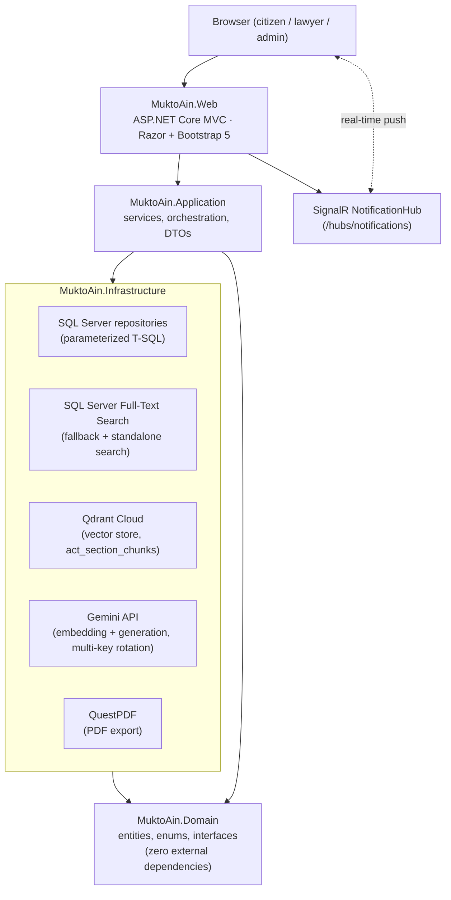
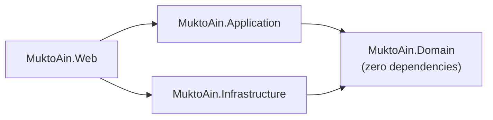
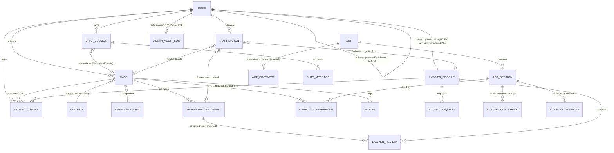
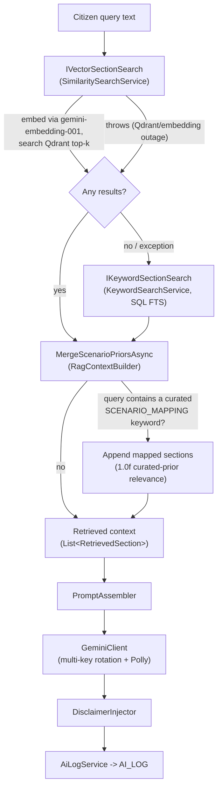
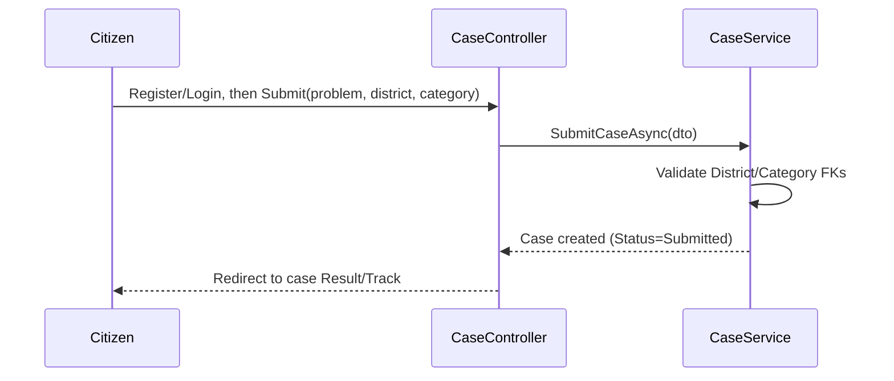
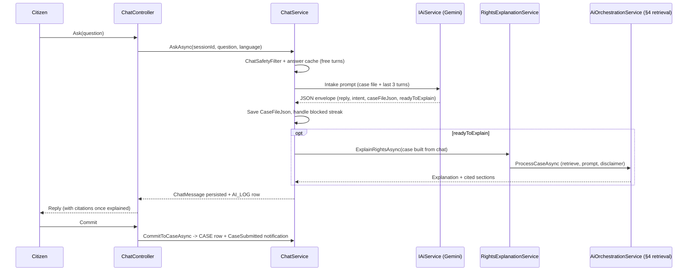
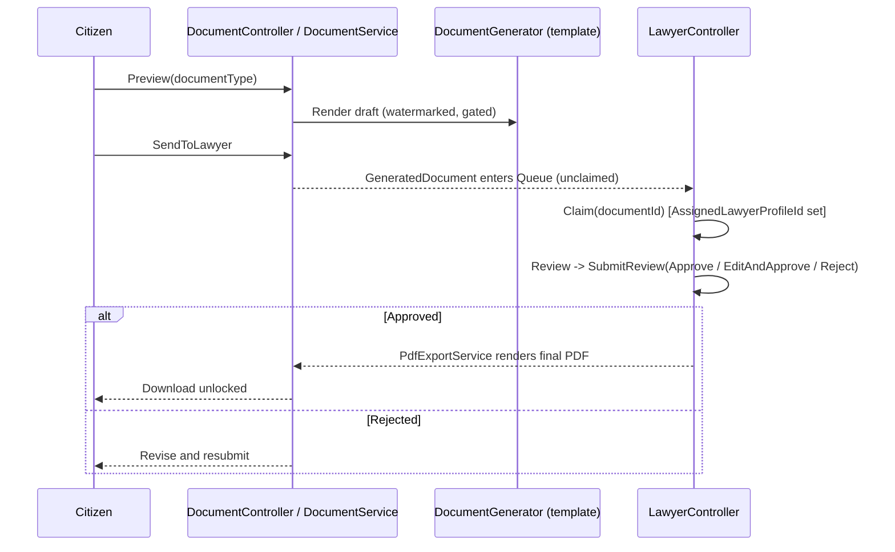
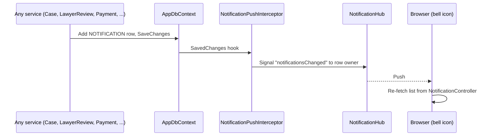

# MuktoAin (মুক্ত আইন) — Architecture

> **Disclaimer:** MuktoAin provides general legal information, not formal legal
> advice. Every AI-generated draft passes a mandatory verified-lawyer review
> gate before a citizen can download or finalize it. The 3-surface disclaimer
> policy (persistent UI banner → AI-output injection → document/PDF stamping)
> is enforced at every layer described below — see §8.

---

## 1. System Overview

### 1.1 Mission summary

MuktoAin (মুক্ত আইন, "Free Law") is an AI-augmented legal-aid platform for
Bangladesh. A citizen describes a legal problem in Bangla, English, or mixed
Banglish; the platform retrieves the relevant Bangladeshi statutes, explains
applicable rights in plain language, and auto-drafts structured legal
documents (General Diary, RTI request, Labour complaint, Consumer complaint).
Every AI-generated draft is locked behind a mandatory verified-lawyer review
gate before a citizen can download it. See [../README.md](../README.md) for
the project mission statement and team.

### 1.2 High-level component diagram



### 1.3 Technology stack

| Layer | Choice | Notes |
|---|---|---|
| Backend framework | ASP.NET Core MVC (.NET 8) | Course-mandated stack |
| Data access | Manual parameterized MSSQL (`Microsoft.Data.SqlClient` / EF Core raw SQL) | No EF migrations — schema is hand-authored T-SQL in `scripts/`, run in SSMS |
| Relational DB | Microsoft SQL Server (SSMS-managed) | LocalDB / SQL Server Express for local dev |
| Vector DB (RAG) | Qdrant Cloud, `.NET SDK` | Canonical shared collection `act_section_chunks` |
| Full-text search | SQL Server FTS (`scripts/03_fulltext.sql`) | **Fallback only** when Qdrant fails, plus standalone Acts search (FR-7) |
| Embedding model | `gemini-embedding-001` | 3072-dim (MRL-truncatable to 768/1536); `Qdrant:VectorSize` must match |
| Generation model | Gemini API, configurable via `Gemini:GenerationModel` | Code default `gemini-2.0-flash`; the shipped dev config overrides to `gemini-3.6-flash` because Google retired `gemini-2.0-flash` — behind the swappable `IAiService` interface |
| Frontend | Razor Views + Bootstrap 5 + vanilla JS/fetch | Server-rendered MVC, no SPA framework |
| Auth | ASP.NET Core Identity | Roles: Citizen, Lawyer, Admin (`User.Role` enum + claims transformation); `User.IsSuperAdmin` adds a SuperAdmin tier |
| Real-time | ASP.NET Core SignalR | `NotificationHub` pushes "notifications changed" signals; client polls only while disconnected |
| Concurrency | SQL Server `rowversion` | Optimistic tokens on `CASE` and `GENERATED_DOCUMENT` (AUD-4) |
| PDF generation | QuestPDF | Renders only lawyer-approved content, Noto Sans Bengali |
| Batch/workers | `IHostedService` | `EmbeddingBatchJob` (registered in `Program.cs`) |
| Resilience | Polly | Retry/circuit-breaker around the Gemini HTTP client (`GeminiResiliencePolicies`) |

### 1.4 Project dependency diagram



`MuktoAin.Domain` references nothing else — no NuGet packages beyond
`Microsoft.Extensions.Identity.Stores` (needed for `User : IdentityUser<int>`,
a deliberate, documented exception to the zero-dependency rule). Application
depends only on Domain interfaces, never on Infrastructure concretes —
enforced project-reference-wise and by convention in code review.

---

## 2. Clean Architecture — 4-Project Structure

| Project | Responsibility | Key folders |
|---|---|---|
| `MuktoAin.Domain` | Entities, enums, repository/service interfaces, constants | `Entities/` (21 classes), `Enums/` (14), `Interfaces/Repositories/`, `Interfaces/Services/`, `Constants/` (`Disclaimers`, prompt templates), `Common/` (`ConcurrencyConflictException`, `SectionNumberResolver`), `Models/` (`RetrievedSection`, `VectorSearchResult`) |
| `MuktoAin.Application` | Business logic, AI orchestration, DTOs | `Services/` (~27 classes plus their interfaces: `CaseService`, `ChatService`, `AiOrchestrationService`, `RagContextBuilder`, `PromptAssembler`, `SearchService`, `LawyerReviewService`, `LawyerVerificationService`, `PaymentService`, `DocumentService`, `DisclaimerInjector`, `ActsManagementService`, `ScenarioMappingService`, `ModerationService`, `NotificationService`, `LawyerQueueNotifier`, `AdminAuditService`, `UserManagementService`, `BenchmarkRunnerService`…), `DTOs/`, `Documents/` (`IDocumentTemplate`, `DocumentGenerator`, 4 templates: GeneralDiary/RTI/Labour/Consumer) |
| `MuktoAin.Infrastructure` | External integrations, persistence | `Repositories/` (7 files: generic `Repository<T>` plus Act, ActSection, ActSectionChunk, Case, ChatHistory, ScenarioMapping), `VectorStore/` (`QdrantVectorStore`, `SimilaritySearchService`, `EmbeddingBatchJob`, `EmbeddingQuotaState`), `Ai/` (`GeminiClient`, key rotation, `GeminiResiliencePolicies`), `Search/KeywordSearchService.cs`, `Documents/PdfExportService.cs`, `Security/EncryptionService.cs`, `Data/` (`AppDbContext`, `Configurations/` — 21 EF configuration classes, `Seeding/` — `ActImportService`, `LegalChunkingService`, `SeedAdminUser`, `SeedDistricts`, `SeedCategories`, `SeedScenarioMappings`) |
| `MuktoAin.Web` | Presentation | `Controllers/` (11: Account, Admin, Case, Category, Chat, Document, Home, Lawyer, Notification, Payment, Search), `Hubs/NotificationHub`, `Services/NotificationPushInterceptor` (EF `SaveChangesInterceptor`), `Auth/` (claims transformation), `Middleware/`, `Views/`, `ViewModels/`, `wwwroot/` |

The dependency rule is enforced directly by project references (`.csproj`
`ProjectReference` entries) — Application cannot compile against
Infrastructure types, so retrieval seams like `IVectorSectionSearch` /
`IKeywordSectionSearch` live in `Domain.Interfaces.Services` and are
implemented in Infrastructure.

---

## 3. Data Model — 14-Entity Schema (+ 7 Supporting Entities)

AGENTS.md §2 defines **14 core entities** for the domain model. The EF model
adds **7 supporting entities** that exist for cross-cutting concerns rather
than the core statute/case/document workflow: `LawyerReview`,
`CaseActReference`, `AnswerCache`, `PaymentOrder`, `PayoutRequest`,
`Notification`, `AdminAuditLog` — 21 entity classes total
(`src/MuktoAin.Domain/Entities/`). Documenting only the 14 would omit real,
load-bearing tables, so both groups are covered below.



Notes not obvious from the diagram alone:

- **`AnswerCache` has no foreign key at all** — it is a standalone
  question→answer cache keyed by a unique `QueryHash`, not linked to
  `ChatMessage` or `Case` by FK.
- **`PaymentOrder`**'s `UserId`, `CaseId`, and `LawyerProfileId` are all
  nullable — it covers both citizen top-ups (`UserId` only) and lawyer
  honorarium payouts (`CaseId` + `LawyerProfileId`).
- **`AdminAuditLog.TargetUserId` is a soft reference**, not an FK, so the
  audit row survives if the target user is ever hard-deleted.
- **`CASE` and `GENERATED_DOCUMENT` carry a `RowVersion` column** (SQL Server
  `rowversion`, `scripts/17_add_rowversion_columns.sql`). The generic
  repository turns EF's `DbUpdateConcurrencyException` into the domain
  `ConcurrencyConflictException`. So when two lawyers claim the same
  document at once, the second claim returns `false` and nothing is overwritten.

| Entity | PK | Purpose | Key columns / notes |
|---|---|---|---|
| `District` | `DistrictId` (byte) | 64-row lookup | `Case.DistrictId` FK — never free text |
| `CaseCategory` | `CategoryId` | 4-row lookup (labour, RTI, consumer, general) | Bilingual `Name`/`NameBn`, `CommonActions`/`CommonActionsEn` |
| `User` | `Id` (inherited `IdentityUser<int>`) | Citizen/Lawyer/Admin account | `Role` enum drives claims-based authorization; `IsSuperAdmin` flag; `CreatedByAdminId` self-FK for admin-created accounts |
| `Act` | `ActId` | One statute (e.g. "The Labour Act, 2006") | `TokenCount`, `SourceUrl`, `ImportedAt` |
| `LawyerProfile` | `LawyerProfileId` | Verified-lawyer credentials | **No `CaseId`** — a lawyer never links to a case directly; `UserId` is a UNIQUE FK (1-to-0..1), not a shared PK |
| `Case` | `CaseId` | A citizen's submitted legal problem | `UserId` nullable (guest cases via `AnonymousTrackingCode`), `Status` enum, `RowVersion` |
| `ActSection` | `SectionId` | One numbered section of an Act | `OrdinalPosition`, `SectionText` |
| `ActFootnote` | `FootnoteId` | Amendment history — **Act-level**, not section-level | `FootnoteOrder`, `FootnoteText` |
| `ActSectionChunk` | `ChunkId` | Sub-section text chunk for embedding | `VectorId` (Qdrant point id, null until embedded), `ContentHash` (SHA-256, drives re-embedding) |
| `ScenarioMapping` | `MappingId` | Hand-curated keyword → section boost (FR-18) | `SectionId` FK, `ScenarioKeyword`, `Notes` — no category/boost-weight column |
| `GeneratedDocument` | `DocumentId` | One drafted legal document | `AssignedLawyerProfileId` (claim guard), `VersionNo`, `ContentDraft`/`ContentFinal`, `RowVersion` |
| `CaseActReference` | `CaseActReferenceId` | Section-level citation on a case | `RelevanceScore`, `RetrievalMethod` — citations are section-granular even though embeddings are chunk-granular |
| `LawyerReview` | `ReviewId` | One review decision on one document version | `Decision` enum, `Comments` |
| `AiLog` | `LogId` (long) | Every AI call, for audit (FR-12) | `CaseId` nullable, `TokensUsed`, `LatencyMs` |
| `ChatSession` | `ChatSessionId` | One RAG chat conversation (listed in the chat history sidebar) | `UserId` nullable + `SessionKey` for guests (filtered unique index), `Title`, `CaseFileJson` (facts gathered so far), `Status`, `BlockedStreak`, `CommittedCaseId` |
| `ChatMessage` | `ChatMessageId` | One turn in a chat session | `Role`, `Content`, `CitedJson` |
| `AnswerCache` | `AnswerCacheId` | Standalone Q&A cache | `QueryHash` unique — no FK to any other table |
| `PaymentOrder` | `PaymentOrderId` | Citizen top-up or lawyer honorarium | `UserId`/`CaseId`/`LawyerProfileId` all nullable, `GatewayRef` |
| `PayoutRequest` | `PayoutRequestId` | Lawyer's request to withdraw earned honoraria | `LawyerProfileId` FK, `IsPaid` |
| `Notification` | `NotificationId` | One in-app notification for one user | `Type` enum, optional related case/document/lawyer, `IsSeen` (clears the bell badge) vs `IsRead` (clears the item) |
| `AdminAuditLog` | `AdminAuditLogId` | Record of one admin action | `AdminUserId` FK, `Action`, `TargetUserId`/`TargetEntityId` (soft refs), `Details` |

---

## 4. Retrieval Pipeline (Vector-Primary with FTS Fallback)



This is `RagContextBuilder.RetrieveContextAsync` exactly as implemented:
vector search runs first; the keyword (SQL FTS) path is called **only** when
the vector call throws or returns zero results; the scenario-mapping merge
always runs last, appending any curated section whose `ScenarioKeyword`
appears in the raw query text (deduped against what vector/FTS already
found). Per AGENTS.md §3 rule 3: **hybrid queries never run concurrently on
every request** — FTS is fallback-only, plus the standalone Acts keyword
search (FR-7, `SearchController` → `SearchService` → `KeywordSearchService`
directly, bypassing the vector path entirely).

**Ingestion side** (one-time / incremental, independent of the query-time
flow above): `ActImportService` parses the Kaggle Bangladesh Acts dataset
into `Act` → `ActSection` → `ActFootnote` rows → `LegalChunkingService`
splits long sections into ~300–500 token `ActSectionChunk` rows → the
`EmbeddingBatchJob` (`IHostedService`) embeds unembedded chunks
(`VectorId IS NULL`) in token-packed, quota-aware, parallel batches and
upserts them into Qdrant, stamping `VectorId` + `ContentHash`. T-3.1's
`ActsManagementService.ReindexActAsync` recomputes each chunk's SHA-256 and
nulls `VectorId` on a mismatch, which re-enrolls that chunk in the batch
job's next pass — the mechanism is diff-and-requeue, not a rebuild.

---

## 5. AI Generation & Safety Layer

- **Swappable AI interface:** `Domain.Interfaces.IAiService` /
  `IEmbeddingService` decouple the orchestration layer from any one
  provider; `GeminiClient` is the only implementation today.
- **Multi-key rotation:** `GeminiClient` stripes requests round-robin across
  configured API keys (each key ideally in a separate Google Cloud project,
  since free-tier quota is per-project) and parks a throttled key for
  exactly the `RetryInfo.retryDelay` a 429 response reports, rather than
  serializing all traffic behind one key.
- **Resilience:** `GeminiResiliencePolicies` wraps the HTTP client in Polly
  retry + circuit-breaker policies.
- **Budgeting:** `AiBudgetService` reserves a daily AI-turn quota per
  user/guest before a real model call is made, releasing the reservation on
  both the cached-answer path and the real-turn-succeeded path (a double
  release/no-release bug class the AUD-3 fix specifically closed).
- **Moderation:** `ModerationService` screens submission content before it
  reaches the AI pipeline.

---

## 6. Authentication & Roles

ASP.NET Core Identity (`User : IdentityUser<int>`) backs authentication.
Authorization is role-based off `User.Role` (`Citizen` / `Lawyer` / `Admin`)
projected into claims by a claims-transformation step, not off Identity's
own role/claim tables (none exist in the SSMS-managed schema by design).
`SeedAdminUser` idempotently seeds the initial admin account from the
`SeedAdmin:Email`/`SeedAdmin:Password` config section on startup. A citizen
becomes a lawyer by registering a `LawyerProfile` with a bar registration
number, which starts `Pending` until an admin approves it via
`LawyerVerificationService`.

Admins have two tiers. `User.IsSuperAdmin` adds an `IsSuperAdmin` claim
(`UserRoleClaimsTransformation`), which gates actions such as managing other
admins. Admin actions are recorded in `ADMIN_AUDIT_LOG` through
`AdminAuditService`.

---

## 7. Key Flows

**(a) Case submission**



**(b) Conversational chat (citizen describes a problem)**



Past sessions appear in the chat history sidebar (`ChatController.Recent`,
keyset-paged by `ChatHistoryRepository`). Three blocked turns in a row lock
the session (`ChatSessionStatus.Blocked`).

**(c) Document generation & mandatory lawyer review gate**



**(d) Payments**

```mermaid
sequenceDiagram
    participant U as User (citizen or lawyer)
    participant P as PaymentController
    participant S as PaymentService
    U->>P: TopUp / Honorarium
    P->>S: Create PaymentOrder (sandbox gateway)
    S-->>P: GatewayRef, Status
    Note over S: Lawyer honoraria accrue against LawyerProfile;<br/>PayoutRequest lets the lawyer withdraw them
```

The payment flow above is the current sandbox version and is being rebuilt
as a fuller payment simulation (SSL-1 → SSL-5 in `plans/Dependency_plan.md`).
Treat this section as provisional until that work lands.

**(e) In-app notifications**



`NotificationService` writes the rows and never lets a notification failure
break the main action. `LawyerQueueNotifier` alerts verified lawyers whose
specialisation matches the case category when a document is sent for review.
If the SignalR connection drops, the bell falls back to polling.

---

## 8. Disclaimer Enforcement & Evaluation

The mandatory 3-surface disclaimer policy (AGENTS.md §3 rule 4) is enforced
at every layer this document describes:

1. **Persistent UI banner** — `src/MuktoAin.Web/Views/Shared/_DisclaimerBanner.cshtml`, rendered on every page via the shared layout.
2. **AI-output injection** — `src/MuktoAin.Application/Services/DisclaimerInjector.cs`, called by `AiOrchestrationService.ProcessCaseAsync` on every model response before it reaches the caller.
3. **Document/PDF stamping** — the four templates in `src/MuktoAin.Application/Documents/Templates/` and `src/MuktoAin.Infrastructure/Documents/PdfExportService.cs` stamp the disclaimer into every generated document and PDF.

**Evaluation linkage:** `.agent/spec/requirements.md`'s benchmark harness
runs the retrieval pipeline (§4) against a 2,165-question annotated QA
dataset (see `docs/attribution-CC-BY-SA-4.0.md` §2) to measure grounding
quality outside of manual testing.

---

*Corpus reference numbers (verify against `docs/attribution-CC-BY-SA-4.0.md`
if they look stale): 1,484 Acts, 35,633 sections, 14,523 footnotes, 42,858
chunks, 64 districts, 4 case categories.*
