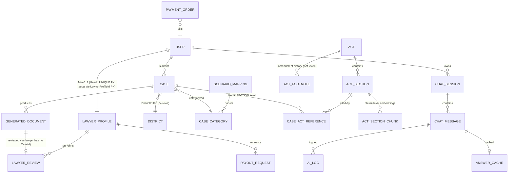

# Project Documentation Pack (T-3.5, S-3.8, S-3.9, A-3.8, A-3.10) Implementation Plan

> **For agentic workers:** REQUIRED SUB-SKILL: Use superpowers:subagent-driven-development (recommended) or superpowers:executing-plans to implement this plan task-by-task. Steps use checkbox (`- [ ]`) syntax for tracking.

**Goal:** Produce the 5 Checkpoint-3 documentation deliverables — `docs/architecture.md` (T-3.5), updated `docs/deployment-guide.md` (S-3.8), rewritten root `README.md` (S-3.9), new `docs/user-guide.md` (A-3.8), and new `docs/testing-report.md` (A-3.10) — each describing the **real** codebase, verified by inspection at execution time, not invented.

**Architecture:** Documentation-only changes; zero production code touched. All 5 deliverables cross-link: README → architecture.md + deployment-guide.md + attribution-CC-BY-SA-4.0.md; user-guide → deployment-guide.md; testing-report → Testing_Plan.md. Each doc states the mandatory 3-surface disclaimer policy. Every numeric claim (entity counts, test counts, script counts, dataset stats) must be re-verified by the executor with the commands given in this plan at execution time — the numbers below were captured on 2026-09-12 and will drift.

**Tech Stack:** Markdown docs. Verification via PowerShell (pwsh), `rg`, `dotnet test`, and mermaid ERD/flowchart syntax rendered by GitHub.

**Spec:** `.agent/spec/requirements.md` (FR-1–FR-18), `.agent/spec/design.md` (4-project structure, 14-entity schema, retrieval pipeline), `plans/Arpita_plan.md:1082-1211` (S-3.8/S-3.9/A-3.8/A-3.10 task definitions), `plans/Dependency_plan.md:152-160, 288-290` (tracking entries).

## Global Constraints

- **NO git operations.** AGENTS.md §6: agents NEVER commit/stage/push. All changes stay in the working tree for Shads. Plan steps that would commit are replaced with "Record completion in `plans/Dependency_plan.md`".
- **Docs describe REALITY, not fiction.** Before writing any number, path, or command, run the verification commands in the task. If reality differs from this plan (e.g., test counts changed), the doc follows reality — never the plan's cached numbers — and the executor notes the delta in the final summary.
- **3-surface disclaimer policy in every doc:** (1) persistent UI banner (`src/MuktoAin.Web/Views/Shared/_DisclaimerBanner.cshtml` on every page), (2) injected into every AI output (`src/MuktoAin.Application/Services/DisclaimerInjector.cs`), (3) stamped into generated document templates/PDFs (`src/MuktoAin.Application/Documents/Templates/*.cs` + `src/MuktoAin.Infrastructure/Documents/PdfExportService.cs`). Each of the 5 docs contains a statement of this policy and points readers to the user-facing disclaimer text.
- **Language:** All docs in English; Bangla text appears only for UI labels and the bilingual disclaimer quote.
- **Mermaid blocks** in `docs/architecture.md` must use syntax GitHub renders (`erDiagram`, `flowchart TD`). No private extensions.
- **Relative links only** inside docs (e.g., `../README.md`, not absolute paths or `file:///` URLs), so links work on GitHub.
- **Do not delete existing content** in `docs/deployment-guide.md` / `README.md` that is still correct — update in place; the docs already contain a lot of accurate material (Docker section, env-var table, CI section) that survives.
- **Execution order matters:** Task 1 (T-3.5) → Task 2 (S-3.8) → Task 3 (S-3.9) → Task 4 (A-3.8) → Task 5 (A-3.10) → Task 6 (cross-doc verification). S-3.9 references `docs/architecture.md` from T-3.5 and the finalized S-3.8 guide.
- **Plan-tracking rule (AGENTS.md §5):** each task ends by flipping its checkbox in `plans/Dependency_plan.md` (lines 152, 159, 160, 288, 290) to `[x]` wrapped in `~~…~~`.

---

### Task 1: T-3.5 — `docs/architecture.md` (Clean Architecture, ERD, Retrieval Pipeline) — *Hrittika*

**Files:**
- Create: `docs/architecture.md`
- Read (sources of truth): `.agent/spec/design.md`, `AGENTS.md` §2–3, `src/MuktoAin.Domain/Entities/*.cs` (19 files), `src/MuktoAin.Infrastructure/Data/AppDbContext.cs` + `src/MuktoAin.Infrastructure/Data/Configurations/*.cs` (19 config classes = authoritative FK/relationship source), `src/MuktoAin.Infrastructure/VectorStore/*.cs`, `src/MuktoAin.Infrastructure/Search/KeywordSearchService.cs`, `src/MuktoAin.Application/Services/AiOrchestrationService.cs`, `src/MuktoAin.Application/Services/CaseService.cs`, `src/MuktoAin.Application/Services/LawyerReviewService.cs`, `src/MuktoAin.Application/Services/PaymentService.cs`
- Modify: `plans/Dependency_plan.md:152`

**Interfaces:**
- Consumes: nothing (first task).
- Produces: `docs/architecture.md` — Task 3 (S-3.9) links to it as `docs/architecture.md`; Task 4 (A-3.8) links to its §7 key-flows section.

**Target length:** ~400–500 lines.

**Real facts to gather at execution time (run these, use the output):**

```powershell
# 1. Entity list (expected 19 entity classes as of 2026-09-12)
Get-ChildItem src\MuktoAin.Domain\Entities\*.cs | Select-Object -ExpandProperty Name
# 2. Relationship truth: skim each configuration class for HasOne/WithMany chains
rg -n "HasOne|WithMany|HasForeignKey|HasIndex" src/MuktoAin.Infrastructure/Data/Configurations/
# 3. Retrieval flow: confirm vector-primary + FTS fallback wiring
rg -n "SimilaritySearch|KeywordSearch|Fallback|Qdrant" src/MuktoAin.Application/Services/SearchService.cs src/MuktoAin.Infrastructure/VectorStore/SimilaritySearchService.cs src/MuktoAin.Infrastructure/Search/KeywordSearchService.cs
# 4. Background jobs / hosted services
rg -n "AddHostedService|IHostedService" src/MuktoAin.Web/Program.cs src/MuktoAin.Infrastructure/
# 5. Controller inventory (expected: Account, Admin, Case, Category, Chat, Document, Home, Lawyer, Payment, Search)
Get-ChildItem src\MuktoAin.Web\Controllers\*Controller.cs | Select-Object -ExpandProperty Name
```

Verified reference numbers (2026-09-12) — re-confirm, don't copy blindly: **19** domain entity classes (the 14 core entities from AGENTS.md + `LawyerReview`, `CaseActReference`, `AnswerCache`, `PayoutRequest`); **10** controllers; **11** SQL scripts `01`–`10` (`09_` has two files: `09_part_b_tables.sql` + `09_fix_chat_session_sessionkey_unique_index.sql`); corpus 1,484 Acts / 35,633 sections / 14,523 footnotes / 42,858 chunks (per `docs/attribution-CC-BY-SA-4.0.md` §1); 64 districts.

- [ ] **Step 1: Write the document header + §1 System Overview**

Create `docs/architecture.md` with this exact outline (content sourced from the reads above):

```markdown
# MuktoAin (মুক্ত আইন) — Architecture

> **Disclaimer:** MuktoAin provides general legal information, not formal legal
> advice. Every AI-generated draft passes a mandatory verified-lawyer review
> gate. The 3-surface disclaimer policy (persistent UI banner → AI-output
> injection → document/PDF stamping) is enforced at every layer described here.

## 1. System Overview
   - 1.1 Mission summary (3–4 sentences, link ../README.md)
   - 1.2 High-level component diagram (mermaid flowchart:
     Browser → MuktoAin.Web (MVC) → Application services →
     Infrastructure {SQL Server repositories, Qdrant, Gemini API, QuestPDF})
   - 1.3 Technology stack table (mirror AGENTS.md §2: ASP.NET Core MVC .NET 8,
     MSSQL + SSMS-managed scripts, Qdrant .NET SDK, SQL FTS fallback,
     gemini-embedding-001 3072-dim, gemini-2.5-flash generation, Razor +
     Bootstrap 5, Identity roles Citizen/Lawyer/Admin, QuestPDF, Polly,
     IHostedService batch jobs)
   - 1.4 Project dependency diagram (Domain ← Application ← Infrastructure,
     Web references all; note Domain has zero external dependencies)
```

- [ ] **Step 2: Write §2 Clean Architecture 4-Project Structure**

For each project list its real top-level folders and 3–5 representative files (from the globs: Domain has `Entities/` (19 classes), enums, interfaces, `Constants/` (PromptTemplates, Disclaimers); Application has `Services/` (~20 services: CaseService, ChatService, AiOrchestrationService, LawyerReviewService, LawyerVerificationService, PaymentService, DocumentService, DisclaimerInjector, RagContextBuilder, PromptAssembler, SearchService, ModerationService, Encryption-adjacent services…), `DTOs/` (15), `Documents/` (IDocumentTemplate, DocumentGenerator, 4 templates: GeneralDiary, RTI, Labour, Consumer); Infrastructure has `Repositories/` (7), `VectorStore/` (QdrantVectorStore, SimilaritySearchService, EmbeddingBatchJob, EmbeddingQuotaState), `Ai/` (GeminiClient + key rotation + resilience policies), `Search/KeywordSearchService.cs` (SQL FTS), `Documents/PdfExportService.cs` (QuestPDF), `Security/EncryptionService.cs`, `Data/` (AppDbContext, 19 configurations, `Seeding/` incl. ActImportService, LegalChunkingService, SeedAdminUser); Web has `Controllers/` (10), `Views/` (40 .cshtml), `ViewModels/`, localization resources). Include a table: project → responsibility → key folders.

- [ ] **Step 3: Write §3 Data Model — 14-Entity Schema (ERD)**

State explicitly: AGENTS.md defines **14 core entities**; the EF model additionally contains `LawyerReview`, `CaseActReference`, `AnswerCache`, `PayoutRequest` as supporting entities — document all of them (a schema doc that omits real tables is fiction). Render a mermaid `erDiagram` covering (verify each FK against `Data/Configurations/*.cs`):



Follow with a table: entity → PK → purpose → key columns → notes. The notes column MUST capture AGENTS.md §2 integrity rules verbatim in substance: `LAWYER_PROFILE` has **no CaseId** (reviews reach cases solely via `GENERATED_DOCUMENT`), its own `LawyerProfileId` PK with 1-to-(0..1) `UserId` UNIQUE FK; `CASE.DistrictId` FK to 64-row `DISTRICT`; `ACT_FOOTNOTE` is Act-level (amendment history); citations at section level (`CASE_ACT_REFERENCE.SectionId`) vs embeddings at chunk level (`ACT_SECTION_CHUNK`).

- [ ] **Step 4: Write §4 Retrieval Pipeline (Vector-Primary with FTS Fallback)**

Mermaid flowchart of the real path (verify order in `SearchService`/`AiOrchestrationService`): citizen query → scenario-mapping boost (`SCENARIO_MAPPING`) → embed query via `gemini-embedding-001` → Qdrant top-k over `ACT_SECTION_CHUNK` → if Qdrant fails/times out → SQL Server FTS fallback (`KeywordSearchService`, `scripts/03_fulltext.sql` catalog) → `RagContextBuilder` assembles context → `PromptAssembler` → `GeminiClient` (multi-key rotation + Polly retry/circuit-breaker) → `DisclaimerInjector` → response + `AiLog`. Explicit rule callout (AGENTS.md §3 rule 3): **do NOT run hybrid queries concurrently on every request** — FTS is fallback-only, plus standalone Acts keyword search (FR-7) via `SearchController`. Also document the ingestion side: `ActImportService` → `LegalChunkingService` → `EmbeddingBatchJob` (IHostedService, quota-aware, dedupe, parallel token-packed workers per FIX-EMB-1/FIX-EMB-2 in `plans/Dependency_plan.md`).

- [ ] **Step 5: Write §5 AI Generation & Safety Layer, §6 Auth & Roles, §7 Key Flows**

- §5: `IAiService`-style swappable interface, Gemini key rotation, Polly policies, `AiBudgetService`/quota state, `ModerationService`.
- §6: ASP.NET Core Identity, roles Citizen/Lawyer/Admin, seeded admin (`SeedAdminUser`), lawyer bar verification (`LawyerVerificationService`).
- §7: four mermaid sequence diagrams — (a) **Case submission**: Register/Login → CaseController.Submit → CaseService → District/Category validation → GeneratedDocument draft; (b) **RAG chat**: ChatController.Ask → retrieval pipeline (§4) → ChatMessage persisted + AI_LOG; (c) **Document generation & lawyer review gate**: DocumentService → template (`GeneralDiary`/`RTI`/`Labour`/`Consumer`) → **mandatory lawyer review** (LawyerController Queue→Claim→Review) → approved → `PdfExportService` (QuestPDF, Noto Sans Bengali) → download unlocked; (d) **Payments**: PaymentController (sandbox/SSLCommerz per `docs/superpowers/plans/2026-09-12-sslcommerz-sandbox-payment-gateway.md`) → PaymentOrder → PayoutRequest for lawyer honoraria.
- §8: Disclaimer enforcement recap (the 3 surfaces with exact file paths) + evaluation linkage (`.agent/spec/requirements.md` benchmark, QA dataset 2,165 questions).

- [ ] **Step 6: Verify the document**

```powershell
# mermaid blocks present and balanced
rg -c '```mermaid' docs/architecture.md
# all relative links resolve — every link target exists
rg -o '\]\(([^)#http][^)]*)\)' -r '$1' docs/architecture.md | ForEach-Object { Test-Path $_ }
```

Expected: ≥4 mermaid blocks; every `Test-Path` returns `True`. Read the ERD FK claims against `Data/Configurations/` output from the fact-gathering step — any mismatch → fix the doc, not the schema description.

- [ ] **Step 7: Record completion in plans/Dependency_plan.md**

Flip line 152 from `- [ ] **[T-3.5]** docs/architecture.md …` to `- [x] ~~**[T-3.5]** docs/architecture.md … — Hrittika — [Done: 2026-09-12]~~` (preserve the rest of the line). No git commit (AGENTS.md §6).

---

### Task 2: S-3.8 — Update `docs/deployment-guide.md` — *Arpita*

**Files:**
- Modify: `docs/deployment-guide.md` (exists, 166 lines — **UPDATE, not fresh write**)
- Read: root `Dockerfile`, `.dockerignore`, `.github/workflows/ci.yml`, `src/MuktoAin.Web/appsettings.Development.json.template`, `src/MuktoAin.Web/Properties/launchSettings.json`, `scripts/01_init_database.sql` (AUTO_CLOSE OFF + RCSI hardening), `scripts/run-all.ps1`, `plans/Dependency_plan.md:63` (FIX-DB-1), `plans/Shads_plan.md:229-243` (ENV-BUG port binding), `plans/Dependency_plan.md:65` (FIX-EMB-2)
- Modify: `plans/Dependency_plan.md:159`

**Interfaces:**
- Consumes: Task 1's `docs/architecture.md` (link from §1).
- Produces: finalized deployment guide that Task 3 (S-3.9) quick-start references.

**Target length:** ~280–350 lines (grows from current 166 by adding troubleshooting, script-order table, and corrections).

**Known inaccuracies in the current doc to fix (verify each against reality first):**
1. §1 Docker row says "(S-3.3)" — Dockerfile already exists at repo root; update to current state.
2. §3 env-var table says default generation model `gemini-2.0-flash`; AGENTS.md specifies `gemini-2.5-flash` — check `src/MuktoAin.Infrastructure/Ai/GeminiOptions.cs` and the template for the real default, document that.
3. §2 step 2 says `dotnet restore src/MuktoAin.Web/MuktoAin.Web.csproj` — root has `MuktoAin.slnx` and `src/MuktoAin.sln`; align on one canonical restore command (prefer `dotnet restore src/MuktoAin.slnx`).
4. Missing: scripts `01`–`10` execution order table for SSMS users (current doc only mentions `run-all.ps1` and hints `01→02→03`).
5. Missing: FIX-DB-1 lessons (AUTO_CLOSE OFF) and port-binding (winnat) troubleshooting.

**Real facts to gather:**

```powershell
Get-Content src\MuktoAin.Web\appsettings.Development.json.template   # real config keys
rg -n "GenerationModel|EmbeddingModel" src/MuktoAin.Infrastructure/Ai/GeminiOptions.cs src/MuktoAin.Web/appsettings*.json*
Get-ChildItem scripts\*.sql | Select-Object Name     # full 01–10 order incl. two 09_ files
Get-Content src\MuktoAin.Web\Properties\launchSettings.json   # real dev port (5250 http profile)
rg -n "EXPOSE|FROM" Dockerfile
```

- [ ] **Step 1: Update §1 Prerequisites + §2 Local Development Setup**

Fix inaccuracies 1–3 above. Replace §2 step 4's one-liner with a **schema script execution-order table**: step → script file → what it creates (01 init DB + AUTO_CLOSE OFF/RCSI, 02 core schema, 03 full-text catalog, 04–06 category bengali/common-actions columns, 07 embedding optimization, 08 redesign tables, 09 part-B tables (+ sessionkey unique-index fix), 10 case title width fix) with the note: "`.\scripts\run-all.ps1` runs all of these in order; SSMS users run them numerically, including both 09_* files." Keep the auto-seed-on-startup explanation and SeedAdmin subsection (already correct).

- [ ] **Step 2: Add §2.5 "Verifying Full-Text Search" + refresh §4 Docker section**

§2.5: the `SELECT FULLTEXTSERVICEPROPERTY('IsFullTextInstalled')` check with the LocalDB warning (already partly present in §1 warning — dedupe, don't duplicate). §4 Docker: keep existing build/run block; add link to the S-3.4 Docker/CICD plan doc — first check it exists:

```powershell
Test-Path docs\superpowers\plans\2026-09-12-docker-cicd.md
```

If `True`, link it (`[Docker & CI/CD plan](superpowers/plans/2026-09-12-docker-cicd.md)`); if `False`, link the root `Dockerfile` + README §4 Docker section instead and note the plan doc is pending in the task summary. Keep the existing port-8080, `.dockerignore` Acts-exclusion, and Trusted_Connection caveats (verified correct against Dockerfile).

- [ ] **Step 3: Expand §3 Secrets Management + verify CI section §5**

§3: keep the env-var table; verify every row against `appsettings.Development.json.template` and `GeminiOptions.cs` (fix the generation-model default if it differs). Add 3–4 lines on Data-Protection key ring for multi-instance (content exists — keep). §5 CI: re-verify against `.github/workflows/ci.yml` — job names (build / unit-tests / gated integration-tests), the `ENABLE_INTEGRATION_TESTS` opt-in, SQL Server 2022 service container, FTS `[Trait("Category","RequiresFts")]` skip note. Correct any drift between doc and yml.

- [ ] **Step 4: Add §7 Troubleshooting with FIX-DB-1 + port-binding lessons**

```markdown
## 7. Troubleshooting
### 7.1 DB timeouts / login failures / RECOVERY_PENDING (FIX-DB-1)
- Root cause: SQL Express default `AUTO_CLOSE ON` + low-RAM machine → per-connection
  DB cold restarts; EmbeddingBatchJob error flood on every `dotnet watch`.
- Fix (already hardened in scripts/01_init_database.sql):
  `ALTER DATABASE MuktoAin SET AUTO_CLOSE OFF;` + RCSI;
  EF `EnableRetryOnFailure(5, 10s)` + `CommandTimeout(60)` in Program.cs.
- Symptom → check: SSMS → database Properties → Options → Auto Close = False.
### 7.2 Kestrel "An attempt was made to access a socket in a way forbidden"
(ENV-BUG, plans/Shads_plan.md): Windows excluded TCP port ranges (Hyper-V/WSL2/winnat).
- Diagnose: `netsh interface ipv4 show excludedportrange protocol=tcp`
- Durable fix: move `http`/`https` profile ports in
  `src/MuktoAin.Web/Properties/launchSettings.json` outside excluded ranges;
  quick fix: `net stop winnat && net start winnat` (admin; non-durable).
### 7.3 "bangladesh-acts-dataset.json not found" startup warning — expected
without the Kaggle dataset; see data/README.md (app runs, no Acts/sections).
### 7.4 QUOTED_IDENTIFIER filtered-index errors when running 02_schema.sql
fragments in SSMS — prefix with `SET QUOTED_IDENTIFIER ON;`.
```

- [ ] **Step 5: Add 3-surface disclaimer statement + cross-links**

Top blockquote (below the title): one sentence stating the 3-surface disclaimer policy with links to `../README.md#6-️-legal-disclaimer` and `architecture.md` §8. Bottom: "See also" list → `../README.md` (daily dev), `user-guide.md` (once Task 4 lands — add the link even if written before it; Task 6 verifies), `architecture.md`.

- [ ] **Step 6: Verify the doc — every command in it actually works**

On the dev machine, run the doc's own commands exactly as written: `SELECT FULLTEXTSERVICEPROPERTY('IsFullTextInstalled');` in SSMS (expect `1`), `.\scripts\run-all.ps1` idempotent re-run (expect "already exists" / no destructive ops), `docker build -t muktoain-web .` (expect success — Dockerfile exists). Verify all relative links resolve (same `rg`/`Test-Path` loop as Task 1 Step 6).

- [ ] **Step 7: Record completion in plans/Dependency_plan.md**

Flip line 159: `- [x] ~~**[S-3.8]** docs/deployment-guide.md … — Arpita — [Done: 2026-09-12]~~`. No git commit.

---

### Task 3: S-3.9 — Rewrite root `README.md` — *Arpita*

**Files:**
- Modify: `README.md` (exists, 289 lines — **rewrite/restructure, preserving correct content**)
- Read: `docs/architecture.md` (Task 1 output), `docs/deployment-guide.md` (Task 2 output), `docs/attribution-CC-BY-SA-4.0.md` (exists), `data/README.md`, `docs/superpowers/plans/2026-09-12-docker-cicd.md` (if it exists), `plans/Dependency_plan.md` (team/task status)
- Modify: `plans/Dependency_plan.md:160`

**Interfaces:**
- Consumes: Task 1's architecture.md, Task 2's deployment-guide.md.
- Produces: root entry-point doc; nothing consumes it downstream in this plan.

**Known defects in the current README to fix:**
1. Broken TOC anchor: `[Local Development Setup](#-muktoain-মকত-আইন)--local-development-setup` — dead link.
2. README duplicates the entire "Local Development Setup" section that now belongs in `docs/deployment-guide.md` — replace with a short Quick Start that links out.
3. Line 71: "*(`A rendered `docs/architecture.md` with ERD lands with Tultul's T-3.5.)*" — stale once Task 1 lands; link it directly.
4. Lines 128–129: "Full license/attribution document (`docs/attribution-CC-BY-SA-4.0.md`) lands with task A-3.6" — the file **already exists** (updated 2026-09-12); link it as done.
5. Team table omits **Hrittika** (T-3.5 assignee, Acts/search per `plans/Dependency_plan.md:152`). Verify Hrittika's role wording from Dependency_plan before writing.
6. No academic context (two-course paired project, ISD) — add per S-3.9 spec in `plans/Arpita_plan.md:1096-1106`.

**Target length:** ~200–260 lines (shrinks from 289 by moving local-setup duplication out; grows by architecture/team/academic sections).

- [ ] **Step 1: Write §0 Mission + §1 Team + §2 Stack**

Mission blockquote (keep existing bilingual statement — it's accurate): "মুক্ত আইন" = Free Law; AI-augmented legal-aid for Bangladesh; Bangla/English/Banglish input; statute retrieval + plain-language rights + auto-drafted documents (GD, RTI, Labour, Consumer); **mandatory verified-lawyer review gate**. Team table: Shads (lead), Tultul, Arpita, Erin, **+ Hrittika** (verify role from Dependency_plan). Academic line: two-course paired project (ISD), requirements/NFRs + 3-checkpoint plan treated as one spec; link `.agent/spec/requirements.md`, `.agent/spec/tasks.md`.

- [ ] **Step 2: Update §2 stack table + §3 architecture overview**

Keep the existing stack table (it matches AGENTS.md §2 — spot-check "gemini-2.5-flash" wording). Architecture overview: keep the 4-project tree; replace the T-3.5 "lands with" note with `Deep dive: [docs/architecture.md](docs/architecture.md)`; keep vector-primary/FTS-fallback + 3-surface disclaimer summary; drop or trim the `.agent/spec/*` deep-dive list to avoid duplication (spec links stay in the academic section).

- [ ] **Step 3: Replace §4 Quick Start with a short version + fix TOC/anchors**

New TOC with **verified anchors** (GitHub slug of each heading — test by rendering or by eye: `#1--technology-stack` style slugs must match). Quick Start: prerequisites one-liner → 5 numbered steps (clone+restore incl. `libman restore`, copy `appsettings.Development.json.template`, `.\scripts\run-all.ps1`, `dotnet run --project src/MuktoAin.Web`, open `http://localhost:5250`) → **"Full setup, secrets, Docker, Azure: [docs/deployment-guide.md](docs/deployment-guide.md)"**. Keep the auto-seed paragraph and the two `dotnet test` commands (unit = no DB; integration = needs SQL Server + secrets).

- [ ] **Step 4: Keep Docker section, fix §5 Attribution, keep §6 Disclaimer, slim §7 Troubleshooting**

Docker section: keep the build/run block, add the docker-cicd plan link if it exists (same `Test-Path` check as Task 2). Attribution: replace the "lands with A-3.6" sentence with a direct link to `docs/attribution-CC-BY-SA-4.0.md` summarizing its 4 sections (Acts dataset CC BY-SA 4.0, QA dataset CC BY 4.0, Noto Sans Bengali OFL 1.1, Lucide ISC). Disclaimer: keep the bilingual blockquote verbatim; add one line describing the 3-surface enforcement policy with a link to `docs/architecture.md` §8. Troubleshooting: keep the `<details>` items that remain useful (file-lock MSB3027, FTS missing, QUOTED_IDENTIFIER, main branch protection, libman) and replace any item now covered by deployment-guide §7 with a link there.

- [ ] **Step 5: Verify README**

```powershell
# no dead relative links
rg -o '\]\(([^)#http][^)]*)\)' -r '$1' README.md | ForEach-Object { Test-Path $_ }
# TOC anchors: extract headings and anchors, compare
rg -n '^#{1,2} ' README.md
```

Expected: every `Test-Path` `True` (including `docs/architecture.md` and `docs/deployment-guide.md` from Tasks 1–2); every TOC entry matches a real heading slug; team table has 5 rows; no occurrence of "lands with T-3.5" or "lands with task A-3.6" (`rg -n "lands with" README.md` → empty).

- [ ] **Step 6: Record completion in plans/Dependency_plan.md**

Flip line 160: `- [x] ~~**[S-3.9]** Root README.md … — Arpita — [Done: 2026-09-12]~~`. No git commit.

---

### Task 4: A-3.8 — Create `docs/user-guide.md` — *Arpita*

**Files:**
- Create: `docs/user-guide.md`
- Read (walkthrough source of truth — document what the routes/actions ACTUALLY are): `src/MuktoAin.Web/Controllers/AccountController.cs` (Login, Register, Profile, ChangePassword, ForgotPassword, RequestPayout), `CaseController.cs` (Submit, Result, SaveDraft, SendToLawyer, Withdraw, Track), `ChatController.cs` (New, Ask, Messages, Recent, Quota, Commit), `SearchController.cs`, `CategoryController.cs`, `DocumentController.cs` (Preview, PDF gate), `LawyerController.cs` (Status, Resubmit, Queue, Claim, Review, SubmitReview, Payments, History), `AdminController.cs` (Dashboard, Analytics, HealthStatus, EmbeddingProgress, Users, Suspend, Lawyers, VerifyLawyer, Corpus, Scenarios, Categories, Transactions, AiLogs), `PaymentController.cs` (Honorarium, TopUp, Status), `src/MuktoAin.Web/Views/Shared/_DisclaimerBanner.cshtml`, `src/MuktoAin.Web/Views/Shared/_LanguageToggle.cshtml`, `docs/Testing_Plan.md` §2 (verified in-scope feature list)
- Modify: `plans/Dependency_plan.md:288`

**Interfaces:**
- Consumes: deployment-guide (Task 2) for "how to run the app" pointer.
- Produces: persona docs; Task 6 links it from README/deployment-guide.

**Target length:** ~800 lines (per `plans/Arpita_plan.md:1174`).

**Real facts to gather:**

```powershell
# exact route attributes + http methods per controller (use these for step-by-step URLs)
rg -n "\[Http(Get|Post)|\[Route\]|public (async )?(Task<)?IActionResult" src/MuktoAin.Web/Controllers/
# localization: confirm bn/en resource mechanism
rg -n "RequestLocalization|SupportedCultures" src/MuktoAin.Web/Program.cs
Get-ChildItem src\MuktoAin.Web\Localization\ -Recurse -ErrorAction SilentlyContinue
```

- [ ] **Step 1: Write §1 Introduction + §2 Getting Started**

§1: audience table (Citizen/Lawyer/Admin), 3-surface disclaimer statement in plain words ("you will see a banner on every page; AI answers and every generated document carry it; documents cannot be downloaded until a verified lawyer approves them") + bilingual disclaimer quote (reuse README §6 text). §2: browser requirements, app URL (`http://localhost:5250` per launchSettings — verify), registration walkthrough with the real form fields from `Views/Account/Register.cshtml`, language toggle (bn/en, `_LanguageToggle.cshtml`).

- [ ] **Step 2: Write §3 Citizen Workflow (the longest section, ~300 lines)**

Numbered walkthrough with real routes, each step: action → URL/screen → what happens → screenshot callout placeholder. (1) Register/Login (`/Account/Register`, `/Account/Login`); (2) browse categories `/Category` (FR-6) and standalone Acts search `/Search` (FR-7); (3) submit case `/Case/Submit` — describe the real fields (problem description in Bangla/English/Banglish, district dropdown from 64-row DISTRICT, category); (4) RAG chat `/Chat/New` → `/Chat/Ask` — citing that answers reference statute sections, quota display `/Chat/Quota`, commit-to-case flow; (5) document generation `/Document/Preview` — 4 template types, **preview is watermarked/gated**; (6) `SendToLawyer` from `/Case/Result`; (7) track status `/Case/Track`; (8) **after lawyer approval only**: PDF download (QuestPDF) — emphasize the gate blocks download pre-approval; (9) payments: top-up + honorarium via `/Payment/*` (sandbox; SSLCommerz flow if landed — verify against `plans/Dependency_plan.md` SSL task status). Insert screenshot placeholders in this exact format so they're greppable: `> 📷 *[SCREENSHOT: citizen case submission form — capture before release]*` — one per numbered subsection (≥9).

- [ ] **Step 3: Write §4 Lawyer Workflow (~200 lines)**

(1) Register as Lawyer → bar verification submission (`/Lawyer/Status`, resubmit on rejection) → admin approval (mention expected wait); (2) review queue `/Lawyer/Queue` (claim mechanics); (3) review screen `/Lawyer/Review` — approve / edit inline / reject with reasons; (4) review history `/Lawyer/History`; (5) payments: honorarium claims `/Lawyer/Payments`, payout request (`RequestPayout` on Account/Profile), PayoutRequest lifecycle; (6) note the disclaimer/stamp obligations the lawyer sees on finalized docs. ≥6 screenshot placeholders.

- [ ] **Step 4: Write §5 Admin Workflow (~180 lines)**

(1) Seeded admin login (env `SeedAdmin__Email`/`SeedAdmin__Password`, link deployment-guide §2); (2) dashboard `/Admin/Dashboard` + health status + embedding progress; (3) user management `/Admin/Users` (suspend/unsuspend); (4) lawyer verification queue `/Admin/Lawyers` (VerifyLawyer/Reject); (5) corpus management `/Admin/Corpus` (Acts stats, re-import), categories `/Admin/Categories`, scenario mappings `/Admin/Scenarios`; (6) analytics `/Admin/Analytics`; (7) transactions `/Admin/Transactions` + refunds; (8) AI logs `/Admin/AiLogs`. ≥8 screenshot placeholders.

- [ ] **Step 5: Write §6 Bilingual Notes + §7 Troubleshooting for Users + §8 FAQ**

§6: what's localized (UI chrome via resource files — cite real mechanism found), what renders bilingual regardless (documents support Bn/En toggle per `docs/superpowers/plans/2026-09-10-document-styling-language-toggle.md`), input language guidance (Bangla/English/Banglish all accepted; mixed-script tips). §7: common end-user issues (no sections in search → Acts dataset not imported; chat quota errors → free-tier Gemini quota, link deployment-guide; PDF font issues → Noto Sans Bengali). §8: 8–10 short FAQs ("Is this legal advice?" → no + disclaimer; "Can I download without a lawyer?" → no; "What does it cost?" → sandbox payments today).

- [ ] **Step 6: Verify the doc**

```powershell
rg -c '📷' docs/user-guide.md        # screenshot placeholders: expect ≥23
rg -o '/[A-Z][a-zA-Z]+(/[A-Za-z]+)*' docs/user-guide.md | Sort-Object -Unique
# spot-check 5 routes from the doc against controllers — each must exist
rg -n "IActionResult (Submit|Queue|Review|Dashboard|Preview)" src/MuktoAin.Web/Controllers/
rg -o '\]\(([^)#http][^)]*)\)' -r '$1' docs/user-guide.md | ForEach-Object { Test-Path $_ }
```

Expected: ≥23 screenshot placeholders, all linked routes match real controller actions (mismatch = doc fiction → fix), all relative links `True`.

- [ ] **Step 7: Record completion in plans/Dependency_plan.md**

Flip line 288: `- [x] ~~**[A-3.8]** docs/user-guide.md … — Arpita — [Done: 2026-09-12]~~`. No git commit.

---

### Task 5: A-3.10 — Create `docs/testing-report.md` — *Arpita*

**Files:**
- Create: `docs/testing-report.md`
- Read: `docs/Testing_Plan.md` (the Lab-6 execution plan this report complements), `tests/MuktoAin.UnitTests/**` (46 files: 45 test classes + `TestDbContextFactory.cs`), `tests/MuktoAin.IntegrationTests/AiPipeline/RagRetrievalSmokeTests.cs`, `.github/workflows/ci.yml`
- Modify: `plans/Dependency_plan.md:290`

**Interfaces:**
- Consumes: nothing from Tasks 1–4 directly, but written last so its "how to run" matches README §3 tests block.
- Produces: nothing downstream in this plan.

**Target length:** ~500 lines (per `plans/Arpita_plan.md:1191`).

**Real facts to gather — run the suite, use ACTUAL output, do not copy the cached numbers:**

```powershell
# 1. Attribute counts per file (baseline as of 2026-09-12: 253 unit + 2 integration
#    [Fact]/[Theory] attributes; note [Theory]+[InlineData] inflates executed-test count)
rg -c "\[Fact\]|\[Theory\]" tests/
# 2. Executed test counts (ground truth for the report)
dotnet test tests/MuktoAin.UnitTests -v normal 2>&1 | Select-String "Passed!|Failed|Passed!"
dotnet test tests/MuktoAin.IntegrationTests -v normal 2>&1 | Select-String "Passed!|Failed|skipped|Passed!"
# 3. Coverage methodology inputs: what's mocked (NSubstitute/Moq usage)
rg -c "Substitute\.|Mock<|Substitute.For" tests/
# 4. Per-module breakdown source
Get-ChildItem tests\MuktoAin.UnitTests -Recurse -Filter *Tests.cs | Group-Object { Split-Path $_.DirectoryName -Leaf } | Select-Object Name,Count
```

- [ ] **Step 1: Write §1 Executive Summary + §2 Methodology**

§1: one-paragraph verdict with the two headline numbers from the actual `dotnet test` runs (unit + integration), pass status, date. §2: four SDLC levels table (adapt `docs/Testing_Plan.md` §1: Unit = xUnit mocked-isolation; Integration = real SQL Server/Qdrant/Gemini via `RagRetrievalSmokeTests` + manual; System = manual browser journeys; Acceptance = FR-1…FR-18 persona walkthroughs referencing Testing_Plan §6) and the repo's testing pyramid rationale (EF InMemory `TestDbContextFactory` for repository tests; mocked `HttpClient`/`IAiService` for services).

- [ ] **Step 2: Write §3 Per-Module Test Counts**

Table with **real numbers from Step 2's `dotnet test` output**, grouped as `tests/MuktoAin.UnitTests` folders: **Controllers** (Account, Admin, Chat, Document, Payment — baseline 33 attributes), **Services** (30 classes — baseline 197; call out `LawyerReviewServiceTests` 24, `CaseServiceTests` 16, `GeminiClientTests` 14, `DocumentServiceTests` 14, `KeywordSearchServiceTests` 12, `EmbeddingQuotaStateTests` 11, `EmbeddingBatchJobTests` 10 as the biggest), **Repositories** (6 classes — baseline 14; note `ActSectionRepositoryTests.cs` shows 0 `[Fact]`/`[Theory]` at baseline — inspect the file and report what it actually contains, e.g. helper-only or [MemberData]), **ViewModels** (6), **Auth** (3). Then **IntegrationTests**: `RagRetrievalSmokeTests` (2, RequiresFts trait behavior in CI). State the methodology explicitly: attribute count vs executed-test-count discrepancy (`[Theory]` rows), coverage % if a coverage collector was run (if none, say so honestly and describe how to add `dotnet-coverage`/`coverlet` — do NOT invent a %).

- [ ] **Step 3: Write §4 What's Mocked vs What's Tested**

Two tables. *Mocked:* Gemini HTTP endpoints (mocked `HttpClient` in `GeminiClientTests`), repositories behind services (EF InMemory), Qdrant client (interface-mocked in `SimilaritySearchServiceTests`/`SearchServiceTests`), current user/Identity context in controller tests, payment gateway in `PaymentServiceTests`. *Real/Integration:* SQL Server schema via scripts 01–10, SQL FTS, Qdrant Cloud, live Gemini in smoke tests, QuestPDF rendering assertions in `PdfExportServiceTests`. Explicitly list **known gaps** (honesty section): no WebApplicationFactory controller integration suite yet (A-3.7 pending per `plans/Arpita_plan.md:1158-1165`), manual-only System/Acceptance levels, no automated coverage gate.

- [ ] **Step 4: Write §5 How to Run the Suite + §6 CI + §7 Conclusions**

§5: exact commands mirroring README §3 — `dotnet test tests/MuktoAin.UnitTests` (no DB needed), `dotnet test tests/MuktoAin.IntegrationTests` (needs real SQL Server + FTS + secrets: `QDRANT_ENDPOINT`, `QDRANT_API_KEY`, `GEMINI_API_KEY_1`), the `RequiresFts` trait filter command, and a filter example (`dotnet test --filter "FullyQualifiedName~LawyerReviewServiceTests"`). §6: CI pipeline behavior (from `ci.yml`: build + unit-tests always; integration-tests opt-in via `ENABLE_INTEGRATION_TESTS` repo variable + secrets; SQL Server 2022 service container; FTS-image caveat). §7: conclusions, biggest risk areas (AI pipeline external-dependency variance, manual System-level coverage), next steps (A-3.7 integration suite, coverage tooling).

- [ ] **Step 5: Verify the report**

```powershell
rg -n "dotnet test" docs/testing-report.md   # every command documented is runnable
# run the doc's own two headline commands and confirm the report's numbers match output
dotnet test tests/MuktoAin.UnitTests -v minimal 2>&1 | Select-String "Passed!"
# links resolve
rg -o '\]\(([^)#http][^)]*)\)' -r '$1' docs/testing-report.md | ForEach-Object { Test-Path $_ }
# no fabricated coverage %
rg -n "coverage" docs/testing-report.md      # every % claim must cite a tool run
```

Expected: numbers in doc == live `dotnet test` output; zero uncited coverage percentages; links `True`.

- [ ] **Step 6: Record completion in plans/Dependency_plan.md**

Flip line 290: `- [x] ~~**[A-3.10]** docs/testing-report.md … — Arpita — [Done: 2026-09-12]~~`. No git commit.

---

### Task 6: Cross-Document Verification & Link Integrity (all 5 deliverables)

**Files:**
- Modify (only if verification finds dead links/stale text): `docs/architecture.md`, `docs/deployment-guide.md`, `README.md`, `docs/user-guide.md`, `docs/testing-report.md`
- Modify: `plans/Dependency_plan.md:152, 154` (if T-3.5 completion satisfies the Hrittika exit-gate dependency chain, note it — the exit gate itself belongs to T-3.4)

**Interfaces:**
- Consumes: all five docs from Tasks 1–5.
- Produces: verification log appended to the final task summary (not committed).

- [ ] **Step 1: Repo-wide link-integrity sweep across all 5 docs**

```powershell
foreach ($f in @('README.md','docs/architecture.md','docs/deployment-guide.md','docs/user-guide.md','docs/testing-report.md')) {
  rg -o '\]\(([^)#http][^)]*)\)' -r '$1' $f | ForEach-Object {
    $resolved = if (Test-Path "$_$") { "$_$" } elseif (Test-Path $_) { $_ } else { $null }
    if (-not $resolved) { Write-Output "BROKEN: $f -> $_" }
  }
}
```

Expected: zero `BROKEN` lines. Fix any found.

- [ ] **Step 2: Disclaimer-policy consistency check**

```powershell
rg -n -i "3-surface|three surfaces|DisclaimerInjector|_DisclaimerBanner" README.md docs/architecture.md docs/deployment-guide.md docs/user-guide.md
```

Expected: all 5 docs state the policy (user-guide §1 quote counts; testing-report via the DisclaimerInjectorTests row — if testing-report lacks an explicit statement, add one line in §2).

- [ ] **Step 3: Mermaid render sanity + command audit**

Visually confirm the GitHub preview renders each mermaid block in `docs/architecture.md` (4+ diagrams: overview, ERD, retrieval, 4 sequences — if the local preview isn't available, validate syntax at minimum: no `;` inside node labels, quoted edge labels). Re-run every shell/SQL command quoted inside the docs (full list in Tasks 2/4/5 verification steps) and confirm outputs match what the docs claim.

- [ ] **Step 4: Final Dependency_plan.md reconciliation**

Confirm lines 152, 159, 160, 288, 290 are all `[x] ~~…~~`. Run the test suite one final time and paste the two `Passed!` lines into the task summary. Report any deltas between plan-cached numbers (19 entities, 253 unit tests, 255 total attributes, 11 scripts, 10 controllers, 40 views) and execution-time reality.

---

## Open Questions / Assumptions (for the human reviewer)

1. **`docs/superpowers/plans/2026-09-12-docker-cicd.md` does not exist yet** (S-3.4's plan doc). Task 2 Step 2 and Task 3 Step 4 both include a `Test-Path` guard and fall back to linking the root `Dockerfile` + README Docker section. If S-3.4 lands before this plan executes, the links resolve to the real file.
2. **Default generation model mismatch:** `docs/deployment-guide.md:66` says `gemini-2.0-flash`; AGENTS.md says `gemini-2.5-flash`. Task 2 instructs the executor to trust `GeminiOptions.cs`/the appsettings template as the source of truth.
3. **`ActSectionRepositoryTests.cs` registers 0 `[Fact]`/`[Theory]`** — either a helper-only class or uses `[MemberData]`/custom attributes; Task 5 Step 2 requires the executor to inspect and report reality.
4. **Coverage %:** no coverage collector is wired into this repo today. The report explicitly forbids invented percentages and documents how to add coverlet instead.
5. **Hrittika's role wording** for the README team table must be confirmed from `plans/Dependency_plan.md` at execution time (she is listed as T-3.5 owner but has no entry in the current README team table).
6. **Target line counts** (~500 architecture / ~800 user-guide / ~500 testing-report) come from the original plan notes (`plans/Arpita_plan.md`, `plans/Dependency_plan.md:288,290`); they're targets, not gates — completeness and accuracy outrank length.
